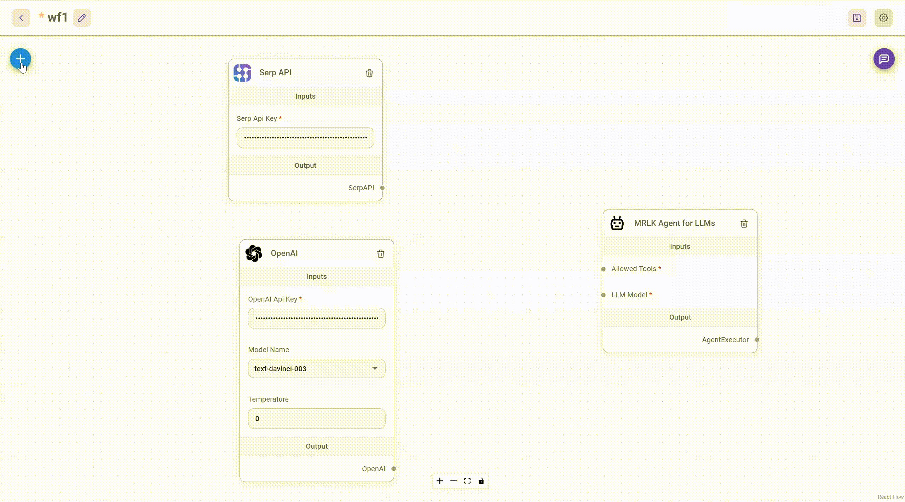

# Flowise AI

Open source low-code tool for developers to build customized LLM orchestration flow & AI agents

Drag & drop UI to build your customized LLM flow



## Reference

- [Github](https://github.com/FlowiseAI/Flowise)
- [Tutorial](https://www.youtube.com/watch?v=9TaRksXuLWY)

## Start

Download and Install [NodeJS](https://nodejs.org/en/download) >= 18.15.0

1. Install Flowise

    ```bash
    npm install -g flowise
    ```

2. Start Flowise

    ```bash
    npx flowise start
    ```

    With username & password

    ```bash
    npx flowise start --FLOWISE_USERNAME=user --FLOWISE_PASSWORD=1234
    ```

3. Open [http://localhost:3000](http://localhost:3000)
